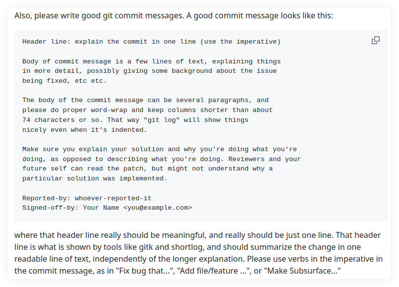

= Commit Messages | Git
:page-subtitle: Git
:page-tags: git commit message
:favicon: https://fernandobasso.dev/cmdline.png
:icons: font
:sectlinks:
:sectnums!:
:toclevels: 6
:source-highlighter: highlight.js
:experimental:
:stem: latexmath
:toc: left
ifdef::env-github[]
:tip-caption: :bulb:
:note-caption: :information_source:
:important-caption: :heavy_exclamation_mark:
:caution-caption: :fire:
:warning-caption: :warning:
endif::[]

== Linus Torvalds

=== Use the imperative, Luke

[quote, Linus Torvalds, Linux Kernel Mailing List]
____
From: Linus Torvalds <torvalds@linux-foundation.org>
To: Linux Kernel Mailing List <linux-kernel@vger.kernel.org>
Subject: Linux 6.12-rc2
Date: Sun, 6 Oct 2024 16:28:36 -0700	[thread overview]
Message-ID: <CAHk-=wgMS-TBfirwuxf+oFA3cTMWVLik=w+mA5KdT9dAvcvhTA@mail.gmail.com> (raw)

Hmm. I have had this mental picture that usually rc2 tends to be one
of the smaller rc's because people take a breather after the merge
window, and/or because it takes a while before people start finding
issues.

But at least this release doesn't seem to show that pattern, and I
went back and did some stats on older 6.x releases, and from a quick
look it looks like it's really only true about half the time. Some
rc2's are indeed fairly small, but not all are. I guess I should have
run the numbers before.

Anyway, this isn't one of the small rc2's. But looking at historical
trends, being a bigger rc2 isn't _that_ unusual, and nothing in here
looks all that odd. Yes, the diffstat may look a bit unusual, in that
we had a global header renaming (asm/unaligned.h -> linux/unaligned.h)
and we had a couple of reverts that stand out as spikes in the stats,
but everything else looks nice and small. In fact, one other
noticeably bigger spike in the diffstat is just due to some folio
documentation updates, not any code changes.

At about a quarter of the diffs, the filesystem changes are a bit
bigger than usual (and would actually have been bigger than the driver
changes if it wasn't for one of those reverts), but that's probably
just a random timing effect. I expect I'll be getting more driver
updates next week.

Anyway, on a completely different note: I try to make my merge commit
messages be somewhat "cohesive", and so I often edit the pull request
language to match a more standard layout and language. It's not a big
deal, and often it's literally just about whitespace so that we don't
have fifteen different indentation models and bullet syntaxes. I
generally do it as I read through the text anyway, so it's not like it
makes extra work for me.

But what *does* make extra work is when some maintainers use passive
voice, and then I try to actively rewrite the explanation (or,
admittedly, sometimes I just decide I don't care quite enough about
trying to make the messages sound the same).

So I would ask maintainers to please use active voice, and preferably
just imperative.

Put another way: I'd love it if people would avoid writing their
descriptions as "In this pull request, the Xyzzy driver error handling
was fixed to avoid a NULL pointer dereference".

Instead write it as "This fixes a NULL pointer dereference in .." or
particularly if you just list bullet points, make the bullet point
just be "Fix NULL pointer dereference in ..".

This is not a big deal, I realize. But I happened to try to rewrite a
few of these cases the last week, and I think simple and to-the-point
language is better. The imperative version of just "Fix X" is about as
clear as it gets.

Linus
____

Source: link:++https://lore.kernel.org/lkml/CAHk-=wgMS-TBfirwuxf+oFA3cTMWVLik=w+mA5KdT9dAvcvhTA@mail.gmail.com/++[Linux Kernel Mailing List message^].

=== Subsurface contributing notes

[quote, Linus Torvalds, SubSurface contributing notes]
____
Also, please write good git commit messages. A good commit message looks like this:

[source,text]
----
Header line: explain the commit in one line (use the imperative)

Body of commit message is a few lines of text, explaining things
in more detail, possibly giving some background about the issue
being fixed, etc etc.

The body of the commit message can be several paragraphs, and
please do proper word-wrap and keep columns shorter than about
74 characters or so. That way "git log" will show things
nicely even when it's indented.

Make sure you explain your solution and why you're doing what you're
doing, as opposed to describing what you're doing. Reviewers and your
future self can read the patch, but might not understand why a
particular solution was implemented.

Reported-by: whoever-reported-it
Signed-off-by: Your Name <you@example.com>
----

where that header line really should be meaningful, and really should be just one line. That header line is what is shown by tools like gitk and shortlog, and should summarize the change in one readable line of text, independently of the longer explanation. Please use verbs in the imperative in the commit message, as in "Fix bug that...", "Add file/feature ...", or "Make Subsurface..."
____

Source: link:https://github.com/torvalds/subsurface-for-dirk/blob/master/README.md#contributing[Subsurface contributing guidelines^].
