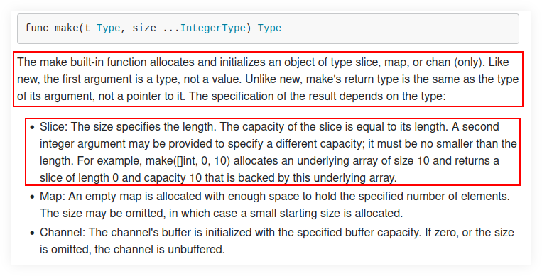

= Maps
:page-subtitle: Go
:page-tags: go map dsa data-structure
:favicon: https://fernandobasso.dev/cmdline.png
:icons: font
:sectlinks:
:sectnums!:
:toclevels: 6
:toc: left
:source-highlighter: highlight.js
:stem: latexmath
ifdef::env-github[]
:tip-caption: :bulb:
:note-caption: :information_source:
:important-caption: :heavy_exclamation_mark:
:caution-caption: :fire:
:warning-caption: :warning:
endif::[]

== Extra keys gotcha

Consider this example:

[source,go]
----
package main

import "fmt"

func getMapKeys[Map ~map[Key]Val, Key comparable, Val any](coll Map) []Key {
	keys := make([]Key, len(coll))
	fmt.Println(len(coll))

	for key := range coll {
		keys = append(keys, key)
	}

	return keys
}

func main() {
	xs := map[string]int8{"one": 1, "two": 2}
	ys := map[int8]string{10: "ten", 20: "twenty"}

	fmt.Printf("#%v\n", getMapKeys(xs))
	// => #[  two one]

	fmt.Printf("#%v\n", getMapKeys(ys))
	// => [0 0 10 20]
}
----

Running the code prints:

[source,text]
----
$ go run ./mapkeys.go 
2
#[  two one]
2
#[0 0 20 10]
----

Why does it print `[  two one]` and `[0 0 20 10]`?
That is, ignoring the order of the resulting keys (which is another topic), why are we not getting `[two one]` and `[20 10]` instead?
Why are we getting the two extra empty spaces in `[  two one]` and the two extra zeroes in `[0 0 20 10]`?

It boils down to the fact that we are using `make()`, and it creates a slice of length 2 (given our inputs).
Then, we _append_ while adding the keys, which enlarges the slices to make room for the keys we are appending.
But the original keys have the zero values for the types, which for the map with `string` keys is the empty string, and for the map with `int8` keys is the number 0 (zero).

So the output `[␠␠two one]` is the first empty string key followed by a space, then the second empty string key followed by another space (that makes up for the two leading spaces`), then the key "two" followed by a space, ending with the key "ten".

We could visualize `[␠␠two one]` as `["" "" two one]`, with the empty double quote strings representing the two empty string keys.

And the output `[0 0 20 10]` follows a similar logic.
Firs the initial two zero values for the original slice of `int8`.
So that is 0 followed by a space, then another 0 followed by another space, ending with the two keys 20 and 10 that we append.

The solution is to pass 0 to `make()` second parameter, so the slice has length 0, and a third integer to specify the capacity.

Something like this:

[source,go]
----
keys := make([]Key, 0, len(coll))
----

This way, we start the slice with length zero so there will be no zero-valued keys, but make the capacity the same as `len(coll)` so we have enough room for all the keys.

With that change (which may look simple, but takes a deeper knowledge or arrays, slices + length vs capacity), our output should look like we originally expected:

[source,go]
----
$ go run mapkeys.go 
2
#[one two]
2
#[10 20]
----

For reference, as of February 2025, this is how the docs for the built-in `make()` looks like:

 

Also see 

* https://pkg.go.dev/builtin#make
* https://go.dev/blog/slices-intro
* https://go.dev/blog/slices

== Resources

* https://quii.gitbook.io/learn-go-with-tests/go-fundamentals/maps
* https://blog.golang.org/go-maps-in-action
* https://dave.cheney.net/2017/04/30/if-a-map-isnt-a-reference-variable-what-is-it

++++

++++
