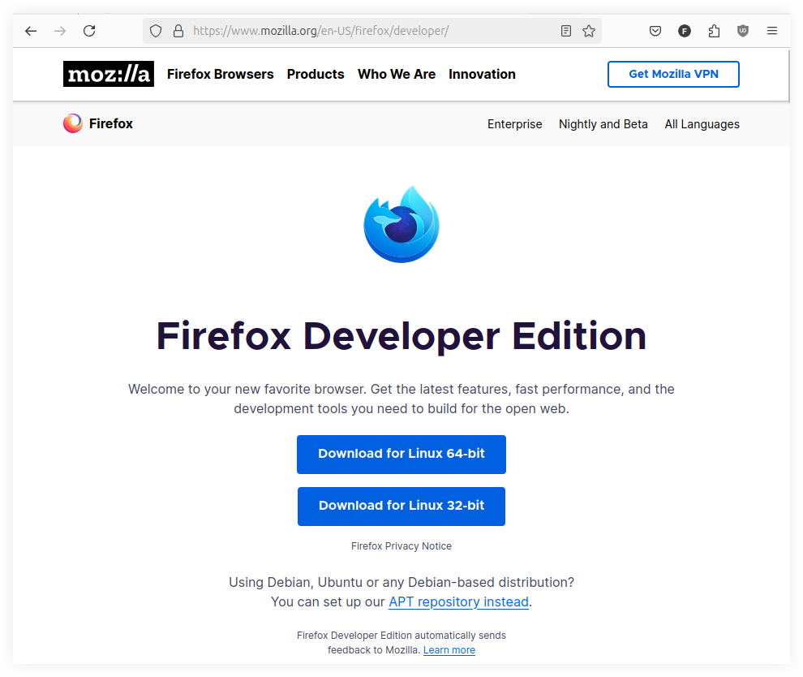
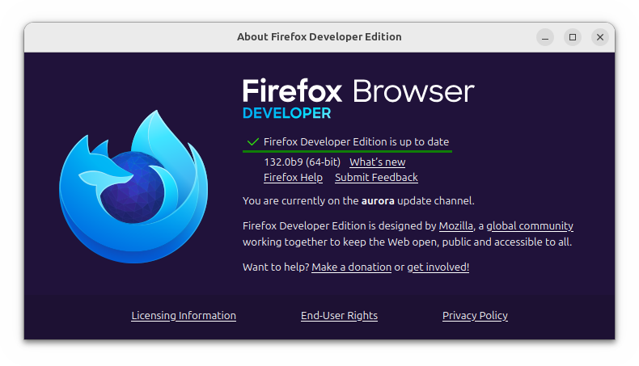
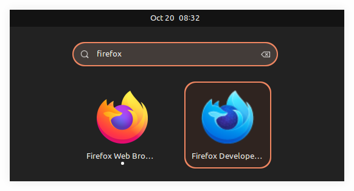
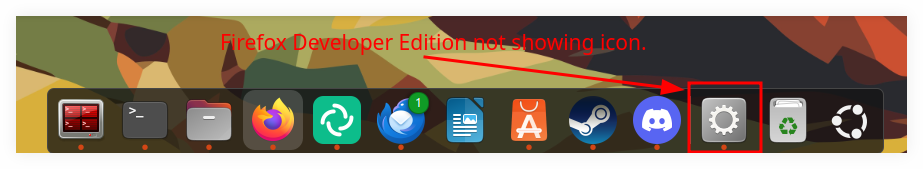
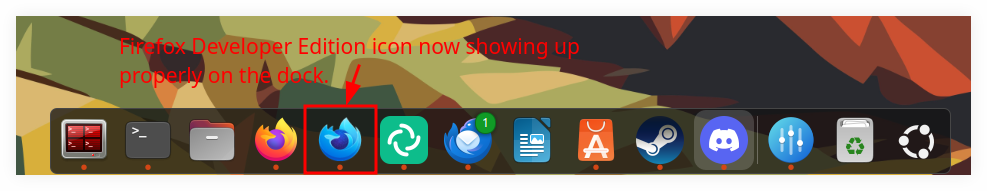

= Firefox Developer Edition Desktop File on Gnome Dock
:page-subtitle: firefox gnome desktop icon launcher
:favicon: https://fernandobasso.dev/cmdline.png
:icons: font
:sectlinks:
:sectnums!:
:toclevels: 6
:source-highlighter: highlight.js
:experimental:
:stem: latexmath
:toc: left
ifdef::env-github[]
:tip-caption: :bulb:
:note-caption: :information_source:
:important-caption: :heavy_exclamation_mark:
:caution-caption: :fire:
:warning-caption: :warning:
endif::[]

== Intro

Besides the default Firefox package, I also use Firefox Developer Edition (aka Firefox Aurora).

== Install and update

We can simply download it, and extract to some place like `~/bin/firefox-dev/`:

[source,shell-session]
----
$ ls -1 ~/bin/firefox-dev/
application.ini
browser/
defaults/
dependentlibs.list
firefox*
firefox-bin*
firefox-bin.sig
firefox.sig
fonts/
glxtest*
gmp-clearkey/
icons/
...
----

And we can simply run `~/bin/firefox-dev/firefox` and it should just work.
And my observation has been that it updates itself automatically whenever there are new releases.

== .desktop file

The Free Desktop organization has long ago link:https://specifications.freedesktop.org/desktop-entry-spec/latest/index.html[designed a specification for the so called “Desktop Files”^].
It means we can create a `.desktop` file for a given application, and then it can be used to open the application and it will display the name and icon the the apps menu, the overview, and other places depending on the desktop environment or window manager being used.

So, let's create one for Firefox Developer Edition:

[source,shell-session]
----
$ mkdir -pv ~/.local/share/applications
$ vim ~/.local/share/applications/firefox-developer-edition.desktop
----

Then, add this content to that file:

.~/.local/share-
[source,ini]
----
[Desktop Entry]
Type=Application
Terminal=false
Exec=/home/deveng/bin/firefox-dev/firefox-bin
Name=Firefox Developer Edition
Comment=Firefox Aurora
Icon=/home/deveng/bin/firefox-dev/browser/chrome/icons/default/default64.png
Categories=GNOME;GTK;Network;WebBrowser;
----

It then shows up, for example in Gnome Shell overview with the proper name and icon we provided:

But after we open it, the icon on the dock does not show up:

I found link:https://askubuntu.com/questions/1251172/active-application-icon-not-shown-on-dock[this post on AskUbuntu.com^] that explains we have to find the `WM_CLASS` property for the application in question.

Basically, we run `xprop WM_CLASS` and click on the Firefox Developer Edition window, and it will show something like this:

[source,text]
----
WM_CLASS(STRING) = "Navigator", "firefox-aurora"
----

We then edit the `.desktop` file again add add the property `StartupWMClass` with the value `firefox-aurora`, like this:

[source,text]
----
StartupWMClass=firefox-aurora
----

The resulting `.desktop` file will be something like this:

[source,diff]
----
[Desktop Entry]
Type=Application
Terminal=false
Exec=/home/deveng/bin/firefox-dev/firefox-bin
Name=Firefox Developer Edition
Comment=Firefox Aurora
Icon=/home/deveng/bin/firefox-dev/browser/chrome/icons/default/default64.png
Categories=GNOME;GTK;Network;WebBrowser;
StartupWMClass=firefox-aurora
----

Then, (after closing and opening Firefox Developer Edition again), the icon on the dock should shouw up just fine.

