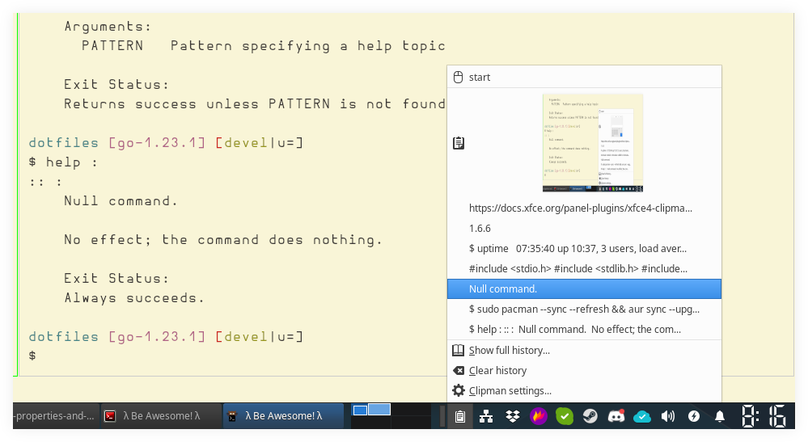

= Linux Keyboard Shortcuts
:page-tags: linux keyboard shortcut keymap application configuration
:favicon: https://fernandobasso.dev/cmdline.png
:icons: font
:sectlinks:
:sectnums!:
:toclevels: 6
:toc: left
:source-highlighter: highlight.js
:stem: latexmath
:experimental:
ifdef::env-github[]
:tip-caption: :bulb:
:note-caption: :information_source:
:important-caption: :heavy_exclamation_mark:
:caution-caption: :fire:
:warning-caption: :warning:
endif::[]

== Xfce Clipman Clipboard Manager

* https://docs.xfce.org/panel-plugins/xfce4-clipman-plugin/start

kbd:[Win+c] to open `xfce4-popup-clipan`.

kbd:[Win+Shift+c] to open `xfce4-clipman-history`, which allows fuzzy searching the history and select with kbd:[Return].

[NOTE]
====
As of Clipman 1.6.6 (2024), the history popup does not show images copied to the clipboard (maybe because we cannot text-search them from the clipboard).
====
