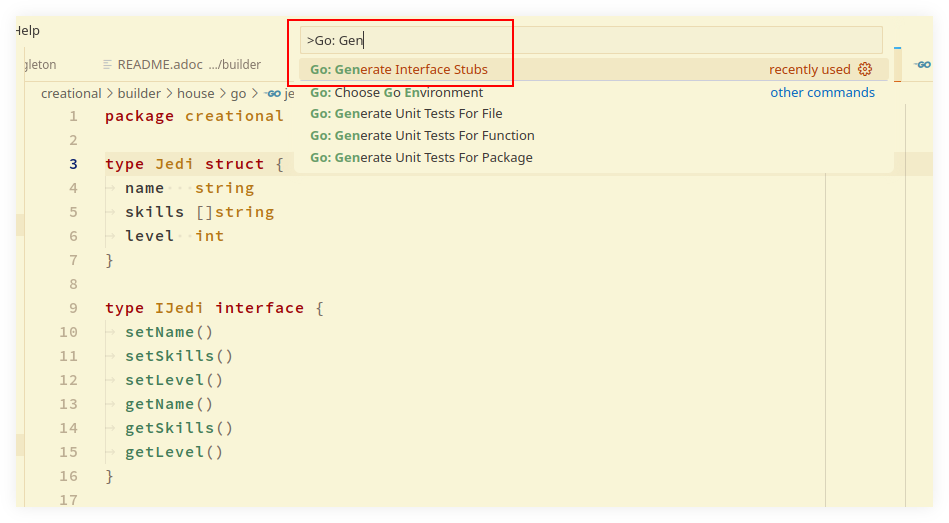
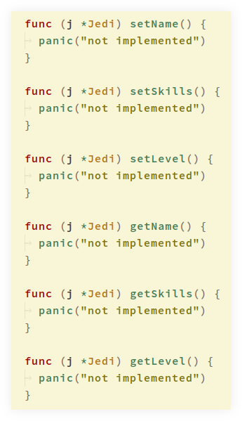

= Go VSCode Tips
:page-tags: go vscode
:favicon: https://fernandobasso.dev/cmdline.png
:icons: font
:sectlinks:
:sectnums!:
:toclevels: 6
:toc: left
:source-highlighter: highlight.js
:stem: latexmath
ifdef::env-github[]
:tip-caption: :bulb:
:note-caption: :information_source:
:important-caption: :heavy_exclamation_mark:
:caution-caption: :fire:
:warning-caption: :warning:
endif::[]

== Intro

These tips assume we are using the Go extension for VSCode:

* https://github.com/golang/vscode-go

== Fill struct with zero values

October 14, 2024

Consider this struct:

[source,go]
----
type Jedi struct {
  name string
  skills []string
  level int
}
----

Then, to have VSCode fill in the default, zero values, type something like this first:

[source,go]
----
var yoda = Jedi{}
----

Then place the cursor inside the braces like "`{ | }`", and type `Ctrl+.` keybinding on Linux/Windows, or `Cmd+.`  on macOS.
The result should look like this:

[source,go]
----
var yoda = Jedi{
	name:   "",
	skills: []string{},
	level:  0,
}
----

== Implement interface stubs

October 14, 2024

Suppose we have a struct and an interface like this:

[source,go]
----
type Jedi struct {
	name   string
	skills []string
	level  int
}

type IJedi interface {
	setName()
	setSkills()
	setLevel()
	getName()
	getSkills()
	getLevel()
}
----

And we want to generate method stubs for the `IJedi` interface and the `Jedi` struct.
On VSCode, open the command palette and type "`Go: Generate Interface Stubs`":

Then specify the parameter, the pointer to the struct, and the interface to implement:

[source,text]
----
j *Jedi IJedi
----

It should result in the six method stubs as per the interface:

[source,go]
----
func (j *Jedi) setName() {
	panic("not implemented")
}

func (j *Jedi) setSkills() {
	panic("not implemented")
}

func (j *Jedi) setLevel() {
	panic("not implemented")
}

func (j *Jedi) getName() {
	panic("not implemented")
}

func (j *Jedi) getSkills() {
	panic("not implemented")
}

func (j *Jedi) getLevel() {
	panic("not implemented")
}
----
