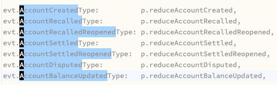
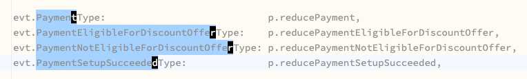

= IdeaVim IntelliJ tips
:page-subtitle:
:page-tags: ideavim vim nvim jetbrains intellij
:favicon: https://fernandobasso.dev/cmdline.png
:icons: font
:sectlinks:
:sectnums!:
:toclevels: 6
:toc: left
:source-highlighter: highlight.js
:stem: latexmath
:experimental:
ifdef::env-github[]
:tip-caption: :bulb:
:note-caption: :information_source:
:important-caption: :heavy_exclamation_mark:
:caution-caption: :fire:
:warning-caption: :warning:
endif::[]

== Multiple Select with IdeaVim

=== Example 1

Consider the code below and suppose we want to select everything between the text _after_ “evt.” up to, but not including “Type”.
That is, from “evt.AccountCreatedType”, we want to select the subtext “AccountCreated”.
And we want to do the same for all other lines.

[source,text]
----
evt.AccountCreatedType:          p.reduceAccountCreated,
evt.AccountRecalledType:         p.reduceAccountRecalled,
evt.AccountRecalledReopenedType: p.reduceAccountRecalledReopened,
evt.AccountSettledType:          p.reduceAccountSettled,
evt.AccountSettledReopenedType:  p.reduceAccountSettledReopened,
evt.AccountDisputedType:         p.reduceAccountDisputed,
evt.AccountBalanceUpdatedType:   p.reduceAccountBalanceUpdated,
----

Position the cursor on the character before the “T” in “Type”:

[source,text]
----
evt.AccountCreatedType:          p.reduceAccountCreated,
                 󰆽
----

Then visual-select up to the colon “:”, maybe with kbd:[v t :].
At this point, “dType” will be visually-selected.

Select the next occurrences of “dType” with kbd:[C+n].
Then, finally press kbd:[b] to go backwards a _word_, which means it will back-select up to, but not including, the dot “.” in “.evt”, and also _unselect_ the previously selected “dType” occurrences.

From there, it is possible to copy, delete, replace, etc.

=== Example 2

Consider this other piece of code:

[source,text]
----
evt.PaymentType:                            p.reducePayment,
evt.PaymentEligibleForDiscountOfferType:    p.reducePaymentEligibleForDiscountOffer,
evt.PaymentNotEligibleForDiscountOfferType: p.reducePaymentNotEligibleForDiscountOffer,
evt.PaymentSetupSucceededType:              p.reducePaymentSetupSucceeded,
----

In this case, the char right before “Type” is not always “d” line in the previous example.

But visual-mode in Vim features the `o` to mean “the **o**ther end of the visually-selected text”
See `:help v_o` in vim/nvim.

Therefore, for this case, instead of placing the cursor on the character before “T” in “Type”, we place the cursor in “T” itself:

[source,]
----
evt.PaymentType:                            p.reducePayment,
           󰆽
----

Then we select up to (but not including) “:” with kbd:[v t :], followed by kbd:[C+n] a few times to select other occurrences of “Type”, and again hit kbd:[b] to back-select one _word_.
All the text between “T” to the dot “.” get selected.
But of course, the problem is that “T” is also selected (which we don't want).

The solution is to use kbd:[o] (“other side of the selection”) so the multiple cursors are back on “T”, and from there, simply do kbd:[h] once to move the cursors one character to the left, thus _unselecting_ “T”.
At this point we are ready to do whatever we need with the selected text.

