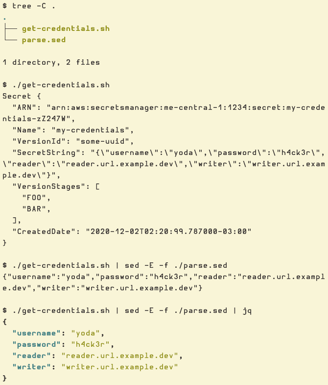

= Sed Real Examples
:page-tags: sed example real
:favicon: https://fernandobasso.dev/cmdline.png
:icons: font
:sectlinks:
:sectnums!:
:toclevels: 6
:toc: left
:source-highlighter: highlight.js
:stem: latexmath
ifdef::env-github[]
:tip-caption: :bulb:
:note-caption: :information_source:
:important-caption: :heavy_exclamation_mark:
:caution-caption: :fire:
:warning-caption: :warning:
endif::[]

== Intro

In this page I'll try to collect examples of instances where I have used sed to solve (or help to solve) actual stuff on my personal or work projects.
There will be no `s/this/that/` examples on this page 😅.

== Extract credentials from cloud provider script

We have a script that fetches and dumps some secrets and credentials that we need to inspect for one reason or another.

In this example, `get-credentials.sh` takes a parameter that indicates from which database instance/environment we want the credentials for (dev, stage, prod, etc.):

[source,text]
----
$ ./get-credentials.sh stage-db
Secret {
  "ARN": "arn:aws:secretsmanager:me-central-1:1234:secret:my-credentials-zZ247W",
  "Name": "my-credentials",
  "VersionId": "some-uuid",
  "SecretString": "{\"username\":\"yoda\",\"password\":\"h4ck3r\",\"reader\":\"reader.url.example.dev\",\"writer\":\"writer.url.example.dev\"}",
  "VersionStages": [
    "FOO",
    "BAR",
  ],
  "CreatedDate": "2020-12-02T02:20:99.787000-03:00"
}
----

Observe the output includes stuff we don't really care about.
What we want is the content of `SecretString` nicely printed and formatted.
We cannot simply pipe that whole output to a command line tool like `jq` because it (the output) is not valid JSON.
Also note because the contents of "SecretString" has all those escaped quotes, a tool like `jq` will not parse it into multiple key-value pairs, but instead, due to the escapes, it is a single string.

What we can do to help a bit is to feed that output to a sed script.
Let's create a file, maybe called `parse.sed` and add this content inside:

[source,text]
----
##
# Keep only line that contains SecretString.
#
/SecretString/!d

##
# Drop leading spaces and trailing spaces.
#
s/(^ *| *$)//g

##
# Get only the actual secret-related data we are interested in.
#
s/"SecretString": (.*)/\1/

##
# Drop trailing comma.
#
s/,$//

##
# Drop the scapes from the \" escaped double quotes.
#
s/\\//g

##
# Drop first and last double quote.
#
s/(^"|"$)//g

#
# The output should now be a valid JSON that could be fed to jq for
# nice formatting and visualization.
#
----

Then, by combining our script that gets and prints the credentials to STDOUT with our Sed script to clean that output up, and then passing _that_ result to `jq`, we should have a nicely formatted output which is easier to understand for our specific purposes.

[source,text]
----
$ tree -C .
.
├── get-credentials.sh
└── parse.sed

1 directory, 2 files

$ ./get-credentials.sh 
Secret {
  "ARN": "arn:aws:secretsmanager:me-central-1:1234:secret:my-credentials-zZ247W",
  "Name": "my-credentials",
  "VersionId": "some-uuid",
  "SecretString": "{\"username\":\"yoda\",\"password\":\"h4ck3r\",\"reader\":\"reader.url.example.dev\",\"writer\":\"writer.url.example.dev\"}",
  "VersionStages": [
    "FOO",
    "BAR",
  ],
  "CreatedDate": "2020-12-02T02:20:99.787000-03:00"
}

$ ./get-credentials.sh | sed -E -f ./parse.sed 
{"username":"yoda","password":"h4ck3r","reader":"reader.url.example.dev","writer":"writer.url.example.dev"}

$ ./get-credentials.sh | sed -E -f ./parse.sed | jq
{
  "username": "yoda",
  "password": "h4ck3r",
  "reader": "reader.url.example.dev",
  "writer": "writer.url.example.dev"
}
----

And here's a screenshot on how it looks on my machine using Kitty terminal with Gruvbox light theme and Hurmit Nerd Font:

++++

++++
