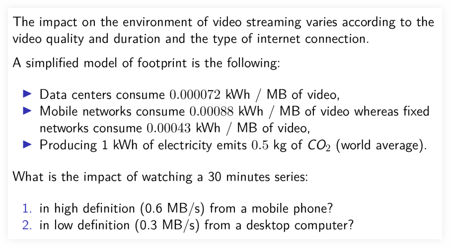

# Video Footprint



## Footprint main formula

The main formula is:

```text
footprint = energyConsumed * megabytesTransferred * kgCO2PerKwh
```

But to be able to apply that main footprint formula, `energyConsumed` and `megabytesTransferred` must be computed first.

## Computing the energy consumed

The energy consumed is the energy consumed by the data center **plus** (addition, not multiplication) the energy consumed by the network.

```text
energyWithMobileNet = 0.000072 + 0.00088
energyWithFixedNet  = 0.000072 + 0.00043
```

## Computing the megabytes transferred

The megabytes transferred is the video duration **times** (multiplication, not addition) the definition (bitrate) of the video.
Because the problem statement gives us the video quality in MB/s, let's make the duration be in seconds too.
So if the duration is 30 mins, we do `30 * 60` (as each minute has 60 seconds).

```text
thirtyMinutesInSeconds = 30 * 60
megabytesTransferredLowRes = thirtyMinutesInSeconds * 0.3
megabytesTransferredHighRes = thirtyMinutesInSeconds * 0.6
```
